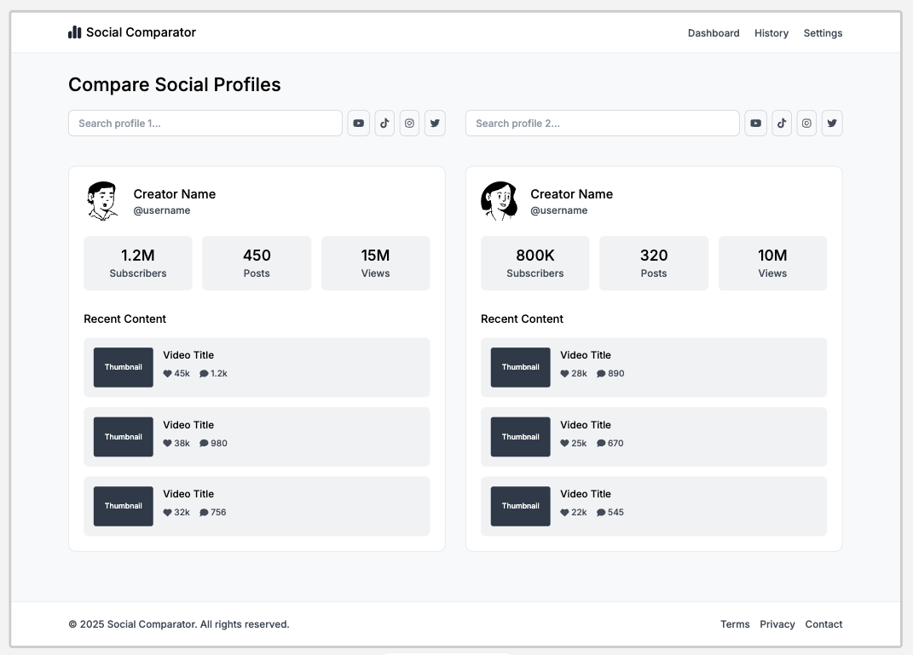

# YouTube Channel Comparator


[](./LICENSE)

This project is a complete example of how to build an SEO‑optimized, server‑side rendered application using **Angular v19**, **Angular Universal** and **Express** to consume the **YouTube Data API v3**. It lets you compare two YouTube channels side‑by‑side—showing subscribers, total videos, total views—and displays the latest 3 videos from each channel with their engagement metrics (likes & comments).

## Table of Contents

- [Technologies](#technologies)  
- [Features](#features)  
- [Wireframe](#wireframe)  
- [Installation](#installation)  
- [Configuration](#configuration)  
- [Usage](#usage)  
- [Project Structure](#project-structure)  
- [Contributing](#contributing)  
- [License](#license)  

## Technologies

- **Angular v19** & **Angular Universal** for SSR and SEO  
- **Express** as a “thin” backend to proxy and cache YouTube API requests  
- **YouTube Data API v3** for channel & video statistics  
- **Node.js** & **TypeScript**  
- **node-cache** (LRU) for in‑memory caching  
- **@angular/pwa** (optional) for PWA support  

## Features

- Autocomplete search for two YouTube channels  
- Side‑by‑side comparison of:
  - Subscriber count  
  - Total video count  
  - Total view count  
- Display of the latest 3 videos per channel, each with:
  - Thumbnail  
  - Title  
  - Like count  
  - Comment count  
- Server‑Side Rendering for full SEO support  
- Dynamic `<title>` and `<meta>` tags per comparison  
- Express‑level caching to minimize YouTube API quota usage  
- Responsive design & optional PWA offline support  

## Wireframe

> **Placeholder:** Add your wireframe image here (e.g. `.github/wireframe.png`)



## Installation

1. **Clone the repository**  
   ```bash
   git clone https://github.com/SEU_USUARIO/youtube-channel-comparator.git
   cd youtube-channel-comparator
